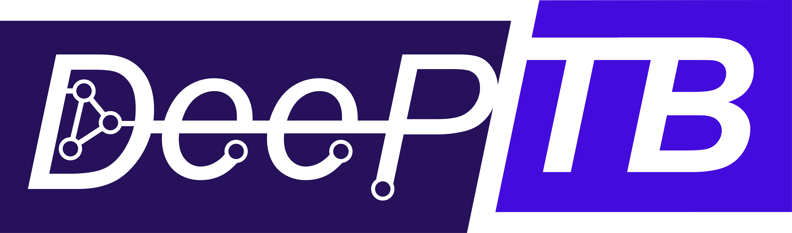

<p align="center">
  
</p>

# DeePTB

DeePTB 用深度学习构建紧束缚模型及原子轨道基下的哈密顿量、密度矩阵和重叠矩阵，支持材料电子结构预测、能带分析和自旋轨道耦合。

本仓库的维护分支是 **`1006-stable`**。版本结构和接口约定见 [维护版本说明](docs/1006-stable.md)。

## 模型与接口

| 模块 | 用途 |
| --- | --- |
| DeePTB-SK | Slater–Koster 参数化及局域环境修正 |
| DeePTB-E3 | 等变原子轨道算符预测；保留上游标准 embedding 接口 |
| UniTB | `unitb` embedding；默认使用 PDQ-MoE，单专家配置为 UniTB-dense；兼容既有生产检查点 |
| `lem`、`slem` | 上游不接受先验输入的基线 |
| `lem_prior`、`slem_prior` | 接受先验输入的基线 |
| `h0`、`dptb.nacf` | 物理 H0 与 NACF 先验构建、缓存和推理 |

UniTB 使用 **H₀-routed shared-basis mixture of experts (PDQ-MoE)**，即 H₀ 先验路由的共享基底专家混合。新配置用 `{"method":"unitb"}` 选择 UniTB 默认 embedding，增加 `"num_experts":1` 得到 UniTB-dense；电荷平衡头与训练先验加噪单独配置。详见 [UniTB](docs/unitb.md) 与 [配置示例](examples/unitb/README.md)。

`lem` / `slem` 与固定上游版本的实现保持原样，不接受先验；需要先验时使用 `lem_prior` / `slem_prior`。先验来源、缺失行为和旧检查点兼容约定见 [基线说明](docs/embedding_baselines.md)。

训练与评测保留 LMDB、重叠矩阵及先验侧车、`multi_train`、HybridMuon、谱裁剪和能带后处理。模型、数据及优化设置由输入配置明确指定。

[SO2CUDA](https://github.com/Franklalalala/SO2CUDA) 提供可选 CUDA 加速，DeePTB 保留接口和 PyTorch 参考实现；不安装也可运行，安装后由后端自动判断 CUDA 加速资格。LEM / SLEM 及其 `_prior` 基线默认走 SO2CUDA 快路径，与 PyTorch 参考实现数值等价，精度、训练 loss 和旋转等变性不变；设 `DPTB_SO2_M_LINEAR_MODE=standard` 或 `SO2_CUDA_BACKEND=off` 即切回参考实现。该版本配合 SO2CUDA 0.2.0，路线与开关见 [后端说明](docs/so2_backend.md)。[LoopSCF](https://github.com/Franklalalala/loopscf) 在独立仓库维护，通过 DeePTB 的通用模型及数据接口使用本版本。

## 安装

使用独立环境，Python 版本范围见 [pyproject.toml](pyproject.toml)。先安装适合当前设备的 [PyTorch](https://pytorch.org/get-started/locally)，再安装与它匹配的 `torch-scatter`：

```bash
git clone --branch 1006-stable https://github.com/Franklalalala/DeePTB.git
cd DeePTB
python docs/auto_install_torch_scatter.py
python -m pip install -e .
```

需要 CUDA 加速时，通过可选依赖安装 SO2CUDA，并使用与 PyTorch 匹配的 CUDA 工具链：

```bash
python -m pip install -e '.[so2]'
```

NACF 的原生先验构建是独立组件，其编译和使用方法见 [NACF 几何推理](examples/nacf_gpu/README.md)。

## 使用与验证

通过 `dptb` 命令训练、评测和运行后处理；各子命令的参数可用 `dptb --help` 查看。Python 接口见 [基本 API](docs/quick_start/basic_api.md)，输入字段见 [配置说明](docs/quick_start/input.md)。

```bash
python tools/test.py
python tools/test.py dptb/tests/test_record_codec.py
```

测试范围、可选依赖和完整测试方法见 [TESTING.md](TESTING.md)。上述短测试用于安装检查；它不替代模型检查点与数值等价性验证。

## English

`1006-stable` provides the UniTB embedding, upstream LEM/SLEM, and separate prior-aware baselines. UniTB uses an H₀-routed shared-basis mixture of experts (PDQ-MoE); its single-expert configuration is UniTB-dense. Legacy checkpoints retain their original parameter names and effective configurations. SO2CUDA 0.2.0 is optional: eligible CUDA inputs use its kernels automatically; the PyTorch reference path remains available. LEM/SLEM and their prior variants take the SO2CUDA route by default; it is numerically equivalent to the PyTorch reference, with the same accuracy, training loss and rotation equivariance. Set `DPTB_SO2_M_LINEAR_MODE=standard` or `SO2_CUDA_BACKEND=off` to use the reference. LoopSCF is maintained in its own repository and depends on this DeePTB branch.

## 文档与引用

在线教程见 [DeePTB 文档](https://deeptb.readthedocs.io/en/latest/)。本维护分支的 UniTB、先验和组件拆分约定以仓库内文档为准。贡献规则见 [AGENTS.md](AGENTS.md) 和 [贡献指南](docs/CONTRIBUTING.md)。

使用 DeePTB 时请引用对应工作：

- **DeePTB-SK**：Q. Gu et al., *Deep Learning Tight-Binding Approach for Large-Scale Electronic Simulations at Finite Temperatures with Ab Initio Accuracy*, [Nature Communications 15, 6772 (2024)](https://doi.org/10.1038/s41467-024-51006-4)。
- **DeePTB-E3**：Z. Zhouyin et al., *Learning Local Equivariant Representations for Quantum Operators*, [ICLR 2025](https://openreview.net/forum?id=kpq3IIjUD3)。

完整引用条目见 [CITATIONS.md](docs/CITATIONS.md)。
