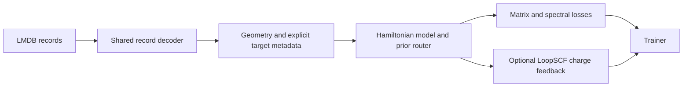

# 0910-stable

This release consolidates LoopSCF, spectral fine-tuning, prior routing, and
compressed-record support on the 0902-stable baseline. The package version
remains 2.0.1; `0910-stable` identifies this source release.

## Architecture



- `dptb.nnops.loopscf` separates k-space assembly, global weighted occupations,
  feedback adapters, iterative prediction, spectral evaluation, and training.
  It preserves electron count, checks overlap capacity, and retains source
  batch fields across repeated forwards. Stepwise training uses an explicit
  backward-completion hook. The launcher installs opt-in compatibility hooks.
- `dptb.nnops.band_losses` provides Hamiltonian-anchored spectral objectives
  with complete configuration schemas and compatibility exports from `loss`.
  Zero spectral weights take the direct Hamiltonian-only path.
- `lem_moe_v3_prior_2b` shares pairwise/GNN logic and explicitly selects serial
  or PA edge routing. Checkpoints retain their architecture-specific shapes.
- One LMDB decoder supports plain pickle, zlib, and zstd records for metadata
  checks and training. Spectral metadata preserves explicit electron counts
  and graph-aligned overlap.
- The release retains prior/target slots, SOC compact residuals, distance
  masks, flow, resume, and optimizer contracts from the baseline.

## Use and verification

See [LoopSCF training](../../examples/loopscf/README.md) for the single entry
point and data requirements. Run the short behavioral suite with:

```bash
python tools/test.py --junitxml=contracts.xml
```

Validation covers numerical and data contracts plus two real structures with
head/MoE checkpoints, strict loading, finite gradients, and a GPU update.
The external validation bundle records the environment and exact source hashes.
Optional backends and full downstream accuracy need separate qualification.

## Compatibility and scope

LoopSCF is experimental and currently supports non-SOC, spin-degenerate,
non-flow single-GPU configurations. Explicit per-graph `nelec` must come from
the actual pseudopotentials and total charge. Check occupation-grid convergence
for each application. SOC data support elsewhere in DeePTB does not extend
LoopSCF's spin contract.

Select the matching serial/PA architecture and use strict checkpoint loading.
Adapter weights from previous occupation semantics can initialize a new run;
they do not reproduce the previous numerical trajectory. Contract validation
does not establish a generalization gain or an SCF fixed-point mapping.
