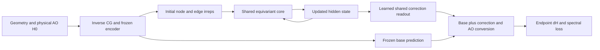

# Shared equivariant latent corrector

This experimental route encodes once, preserves full equivariant node/edge
hidden states, and applies a shared small corrector.
It learns from endpoint Hamiltonian/band labels. It is not an SCF trajectory
model, a charge-density update, or an energy-minimizing functional.

The frozen H0 encoder receives inverse-CG RME features converted from physical
AO-packed H0. The original readout and AO conversion remain frozen. The default
`--latent-readout residual` learns both the recurrent core and a new shared
readout: `H_t = H_base + R_psi(z_t)`. Each distance expert has its own core and
correction readout, shared across recurrent steps:



For active directed edges `src -> dst`, node messages are averaged over incoming
edges; edge messages mix edge and endpoint states. All linear maps connect
matching irreps. Gates depend on irrep-copy norms and multiply all magnetic
components of a copy by the same scalar. The state-update scale is 0.1.
In the default residual-readout route, the core starts nontrivially and the new
readout starts at zero, preserving the base prediction while allowing the
readout to learn immediately and the core to receive gradients after that.
No charge calculation or eigensolver is used
inside the state update. Training spectral losses still require diagonalization.

`K` counts corrector applications, including K1. This differs from scalar WM,
where K1 has no feedback injection. The cache retains actual active-edge row
indices, including subsets or permutations. Each expert's encoder executes once
per input; cached tensors and context are local to that loop invocation. The
wrapper is intended for serial forwards, not concurrent calls on the same model.
The current pilot accepts non-SOC RME output-head routes only.

Three strategies share the same parameterization, initialization, and mean
per-step objective:

| Strategy | State at next step | Gradient across steps |
|---|---|---|
| `bptt` | Previous updated state | Preserved |
| `detach` | Previous updated state | Detached at the boundary |
| `reset` | Original encoded state | No recurrent dependency |

All use one ordinary backward on the summed loss. BPTT and detach have the same
forward map for the same weights. Reset makes identical direct predictions at
each depth, up to numerical noise. The gradient horizon changes the effective
optimization dynamics even at zero initialization; a BPTT gain alone would not
prove that learned physical memory is responsible. Equal optimizer steps do
not establish equal compute. Timing in the evaluator includes compilation and
shared-GPU effects and is diagnostic only.

Example with a clean base checkpoint and the usual residual-dH dataset config:

```bash
python examples/loopscf/train.py --input train.json --output run_bptt \
  --init-model base.pth --mode head --architecture latent \
  --latent-strategy bptt --K 2 --trace-batches
python examples/loopscf/evaluate.py --input evaluation.json \
  --checkpoint run_bptt/checkpoint/nnenv.ep1.pth --base-model base.pth \
  --architecture latent --latent-strategy bptt --label bptt --K 1 2 4 \
  --rotation-indices 0 11 --output bptt_dev.json
```

`--latent-readout frozen` retains an earlier restricted pilot: it trains only
the core, initializes its final maps at zero, and applies the old frozen head
to the updated hidden state. This restriction was our implementation choice,
not a requirement of review direction A. Its results do not evaluate the full
learned-readout design. Neither small core claims to reproduce the complete
Ouro layer stack or its adaptive-depth training.

Repeat with `detach` and `reset` for matched controls. Latent checkpoints require
strict state loading, the matching base architecture, representation version 1,
and explicit matching strategy and readout settings. Scalar-WM adapters cannot be silently loaded
into this family. Occupation diagnostics are null because they do not apply;
path overlap and stored-label closure are still evaluated.
