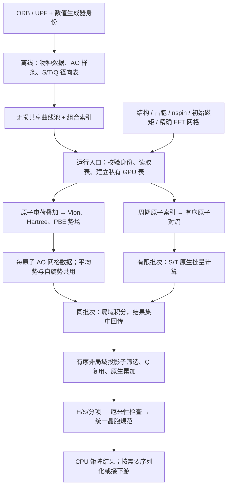

# H0 计算流程与 CUDA 热路径

本流程组装原子初始电荷对应的 `H0 = T + Vnl + Vion + VH[rho0] + Vxc[rho0]` 和 S。与原版 ABACUS 的初始 HR0 比较；不等同于一次密度更新后或收敛后的 H。



## 生命周期

| 数据 | 依赖 | 复用范围 |
|---|---|---|
| 离线物种数据、径向积分表 | ORB/UPF 内容、标量化/SOC、径向网格、生成器与二进制身份 | 匹配输入的所有结构 |
| 共享曲线 | 网格及解码后完整系数字节完全相同 | 多个组合共享；不跨不同网格插值复用 |
| GPU 表主副本 | 表 key、目录、设备 | 两个条目的进程 LRU；消费者仍持有独立副本 |
| 初始电荷与势场 | 当前结构、晶胞、网格、电子数、初始磁矩 | 当前组装；本轮未引入跨几何势场缓存 |
| AO 网格数据 | 当前轨道、原子坐标、FFT 网格 | 当前组装 LRU；平均势和自旋势共享 AO/lookup |
| 投影子候选 | 当前原子、结构、表 session、截止半径 | 当前源原子的出边 |
| Q 因子 | 投影子/轨道物种 ID、精确 float64 位移字节 | 当前组装内、显式内存预算 |
| S/T/局域积分结果暂存 | 当前有限原子对批次 | 默认 128 条边；不提前生成整个 N² 输出 |

## 本轮热路径修改

- `pair_batches.scalar_pair_batches` 将原来逐边调用的 S/T 批量接口接入真实原子对流。每批调用一次原生内核，每个输出张量回传一次；再裁去 padding 并复制成独立 NumPy 块。保持边顺序和位移表达式。
- `CudaPeriodicFFTGridAOCache.contract_chunk` 保持原生逐对积分，集中回传一个有限批次的结果。SOC 的平均势和自旋势进入同一个 AO cache，避免复制轨道值、lookup 和几何支持。
- `PreparedProjectorCandidates` 对固定左端的原子做一次精确筛选；右端用数组筛选。对接近截止面的点再次执行原来的单向量 norm 判定，不能用 epsilon 放宽原截止半径。候选顺序与 Q 的精确位移 key 保持不变。
- 共享表入口仅做一次新的数值环境捕获，用于原契约比较和 key 构建。没有增加进程级“永远有效”身份缓存，也不更新旧表的来源声明。

S/T、局域积分和 Vnl 使用原二进制，轨道插值、FFT 网格、PBE 分支、D 矩阵及非局域累加顺序均未改变。

## 建议的现有 API 调用

`structure`、`species_data` 和 `physics_options` 必须来自已核对的实际输入。核对原版结果时，可由 `production_io.load_case(..., prepared_species=...)` 读取对应网格、磁矩、nspin 和原子输出晶胞偏移；实际应用也可以直接提供这些物理输入。

```python
result = assemble_h0(
    structure, species_data, **physics_options,
    offline_table_dir=shared_table_directory,
    two_center_backend="pyabacus", cuda_precompiled=True,
    compute_device="cuda:0", field_backend="torch",
    structure_factor_backend="cufinufft", structure_factor_nthreads=1,
    strict_reproduction=False,
    local_integration="fft_grid_periodic", spatial_backend="indexed",
    pair_support="nonlocal_complete", hermitize=False,
    projector_search="anchor", projector_reuse_max_mb=256,
    cuda_pair_batch_size=128,
    field_max_work_mb=8192, structure_factor_max_work_mb=12288,
    local_cache_max_mb=4096,
)
```

这里 `strict_reproduction=False` 是现有 NUFFT 路径的显式选项；仍须提供原版 FFT 网格和 cutoff，并直接验证 H/S。不能把它理解为放宽原版对比精度。

`cuda_pair_batch_size` 在预编译 CUDA 路径默认 128。设为 1 可检查 S/T 单对调用路径；这不是恢复整个旧版本。候选 anchor/Q 复用依然由显式选项选择。CPU 参考路径继续使用原流程。一般 CLI 尚未承接所有 CUDA/预制表参数，以上 Python API 是本次实测入口。

## 内存与计时边界

- S/T GPU 暂存量为 `2 * batch_size * max_norb² * 8` 字节；CPU 暂存与最终矩阵另计。局域结果暂存峰值统计同时计入逐对结果和拼接缓冲区。
- 合并 SOC cache 后 `local_cache_max_mb` 是这一份 cache 的预算；Q 因子用独立预算。势场、主表及消费者副本、原生逐对工作区和最终矩阵不包含在 AO cache 预算内。
- 共享磁盘表运行时仍展开成原来的 GPU 系数；没有声称缩小 GPU 径向表。并行 CUDA stream 的 Q cache 仍保留事件等待及 record_stream 生命周期保护。
- 端到端热路径计时包含完整 `assemble_h0`：表校验/装载/复制、势场、所有矩阵、元数据与晶胞转换，并在前后同步 CUDA。输入解析、ABACUS 参考文件读取、结果落盘不在该计时范围。cProfile 仅用于定位，不用其受插桩影响的时间宣称加速。
- 目前原生局域接口内部仍有逐对合法性检查、索引筛选及 CPU 边界读取；这是后续热点候选。本轮没有绕过这些检查或宣称整个 H0 已成为单个 GPU kernel。

## 必须保持的回归

每次改变热路径，使用冻结的精度基线核对 H、S、T、局域势和非局域势全部块的 key/形状/dtype/字节；同时保留对原版 ABACUS 的误差。覆盖 scalar/SOC、不同轨道数、周期镜像、截止点及相邻浮点值、cache 逐出、非默认 stream。新 batch 大小不应改变物理结果。

本轮 4 例性能回归不能替代新版 100 例全覆盖验收，也不等同于完整 DeePTB 模型推理加速。
